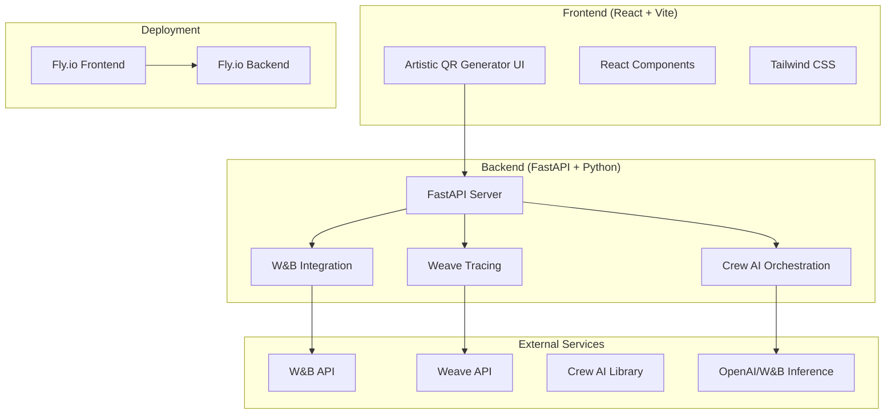
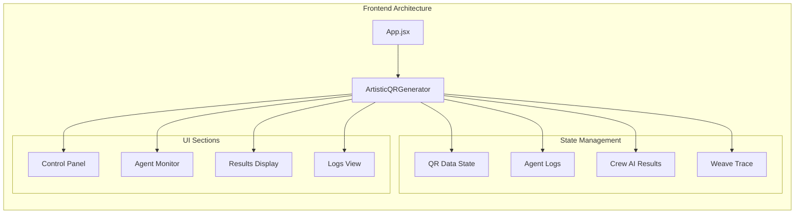
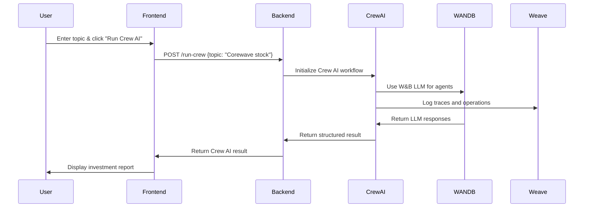
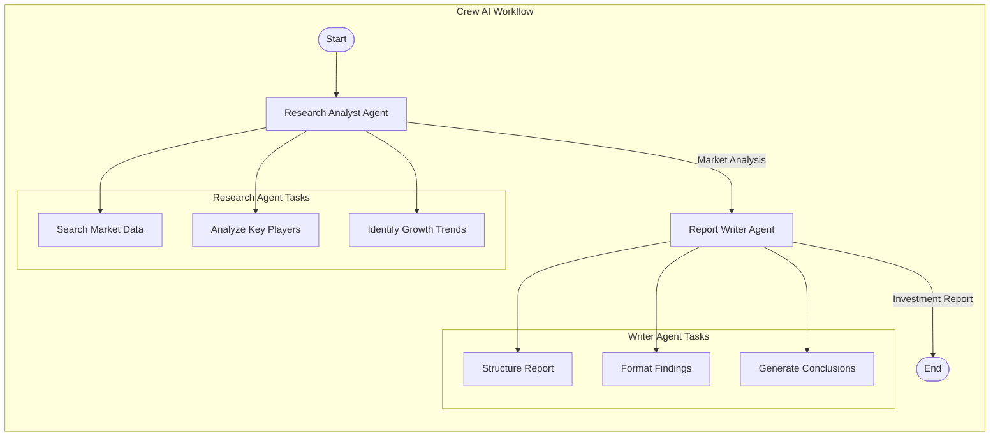
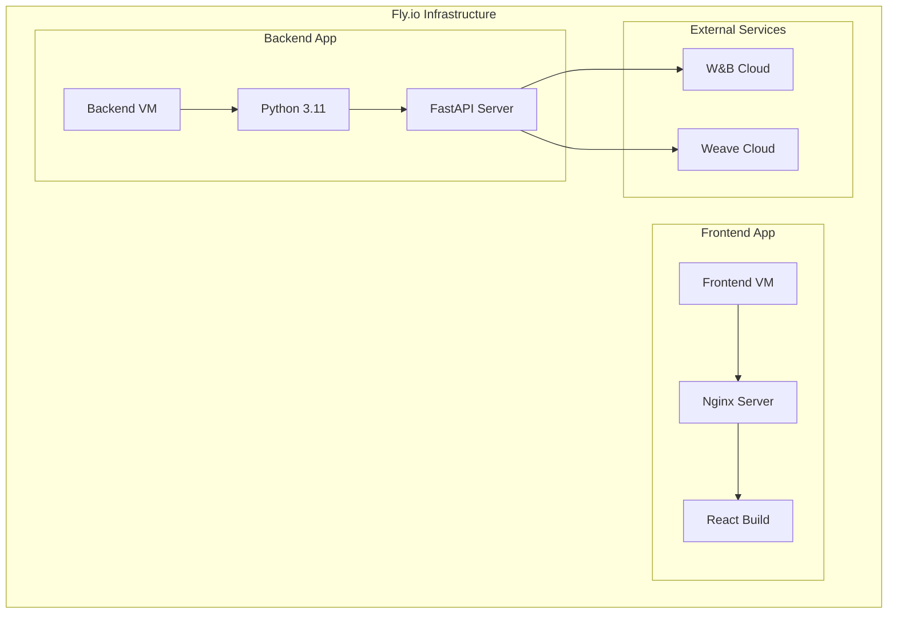

# WeaveHacks Architecture

## System Overview

WeaveHacks is a multi-agent artistic QR code generator that integrates all sponsor tools (Weights & Biases, Google Cloud, BrowserBase, Exa, Fly.io, Crew AI) into a cohesive web application.

## High-Level Architecture



## Component Architecture

### Frontend Components



### Backend Services

```mermaid
graph TB
    subgraph "Backend Architecture"
        FastAPI[FastAPI Application]
        
        subgraph "API Endpoints"
            Health[/health]
            Trace[/trace]
            DebugWANDB[/debug-wandb]
            RunCrew[/run-crew]
        end
        
        subgraph "Core Services"
            CrewRunner[Crew AI Runner]
            WeaveInit[Weave Initialization]
            WANDBInit[W&B Initialization]
        end
        
        subgraph "Agent Orchestration"
            ResearchAgent[Research Analyst Agent]
            WriterAgent[Report Writer Agent]
            LLM[Custom W&B LLM]
        end
        
        FastAPI --> Health
        FastAPI --> Trace
        FastAPI --> DebugWANDB
        FastAPI --> RunCrew
        
        RunCrew --> CrewRunner
        CrewRunner --> ResearchAgent
        CrewRunner --> WriterAgent
        ResearchAgent --> LLM
        WriterAgent --> LLM
    end
```

## Data Flow Architecture

### Request Flow



### Agent Workflow



## Deployment Architecture

### Fly.io Deployment



## Technology Stack

### Frontend Stack
- **Framework**: React 19.1.0
- **Build Tool**: Vite 7.0.4
- **Styling**: Tailwind CSS 3.4.3
- **Icons**: Lucide React 0.525.0
- **Deployment**: Fly.io with Nginx

### Backend Stack
- **Framework**: FastAPI
- **Language**: Python 3.11
- **AI Orchestration**: Crew AI
- **Tracing**: Weave
- **Monitoring**: Weights & Biases
- **Deployment**: Fly.io with Docker

### External Integrations
- **W&B Inference API**: For LLM calls
- **Weave API**: For distributed tracing
- **Crew AI**: For multi-agent orchestration

## Environment Configuration

### Development Environment
```bash
# Frontend (localhost:5173)
npm run dev

# Backend (localhost:8000)
uvicorn main:app --reload
```

### Production Environment
```bash
# Frontend
https://weavehacks-frontend.fly.dev

# Backend
https://weavehacks-backend.fly.dev
```

## Security & Configuration

### Environment Variables
- `WANDB_API_KEY`: W&B authentication
- `WANDB_PROJECT`: W&B project name
- `OPENAI_API_KEY`: OpenAI API access (optional)

### CORS Configuration
- Frontend: Allows all origins for development
- Backend: Configured for cross-origin requests

### Error Handling
- Graceful degradation when W&B/Weave unavailable
- Comprehensive error boundaries in frontend
- Structured error responses in backend

## Performance Considerations

### Frontend Optimizations
- Vite for fast development and optimized builds
- Tailwind CSS for minimal CSS bundle
- React 19 with improved performance
- Nginx with gzip compression and caching

### Backend Optimizations
- Python 3.11 for better performance
- FastAPI for async request handling
- Docker layer caching for faster deployments
- Health checks for reliability

## Monitoring & Observability

### Tracing
- Weave integration for distributed tracing
- W&B for experiment tracking
- Custom trace events for agent activities

### Logging
- Structured logging in backend
- Real-time agent logs in frontend
- Error tracking and debugging

### Health Monitoring
- `/health` endpoint for backend status
- Fly.io health checks
- Automatic restart on failures

## Future Enhancements

### Planned Features
- Real QR code generation with artistic overlays
- Integration with Exa for web search
- BrowserBase automation for data collection
- Google Cloud AI for image generation
- Enhanced agent capabilities

### Scalability Considerations
- Horizontal scaling with Fly.io
- Database integration for persistent storage
- Caching layer for improved performance
- Microservices architecture evolution 